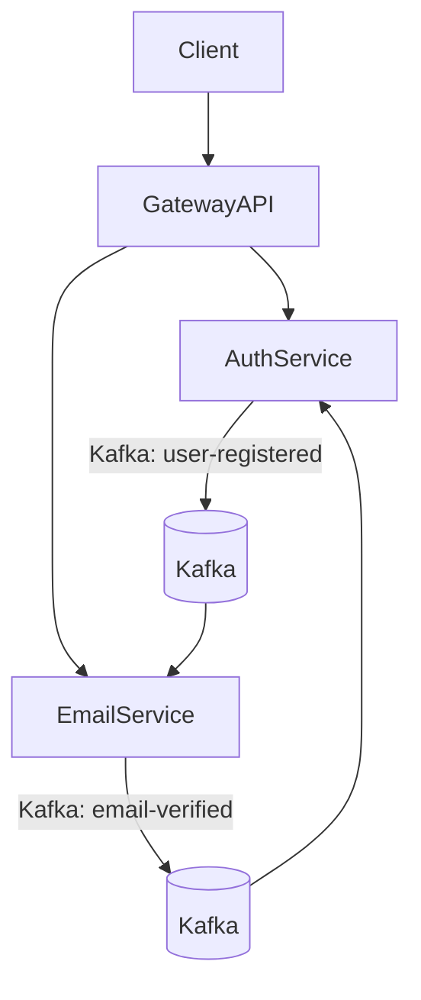

# 🧩 Microservices Project: AuthService + EmailService + GatewayAPI (Kafka-based)

## 📚 Tổng quan

Dự án này xây dựng hệ thống microservices với kiến trúc sự kiện (event-driven) sử dụng Kafka. Bao gồm 3 thành phần chính:

- **GatewayAPI**: Định tuyến các yêu cầu từ client đến từng microservice, đóng vai trò cổng vào duy nhất.
- **AuthenticationService** (`AuthService`): Xử lý đăng ký, xác minh email, gửi và nhận event Kafka.
- **EmailService**: Gửi email xác thực khi có người đăng ký, phản hồi lại event xác thực.

Các service giao tiếp với nhau thông qua **Apache Kafka** sử dụng các **event topics**.

---

## 🧱 Kiến trúc hệ thống



---

## ⚙️ Công nghệ sử dụng

- **ASP.NET Core Web API** (.NET 9)
- **Apache Kafka** + **Confluent.Kafka**
- **Docker** (chạy Kafka)
- **YARP** (API Gateway)
- **JSON** (event message format)
- **BackgroundService** (Kafka consumer)
- **SMTP giả lập** hoặc **SendGrid** (email)

---

## 🗂️ Cấu trúc thư mục

```
/GatewayAPI
  └── appsetting.json
  └── Program.cs

/AuthenticationService
  └── Controllers/
  └── Services/
      KafkaProducerService.cs
  └── Models/

/EmailService
  └── Services/
      KafkaConsumerService.cs
      EmailService.cs
  └── Models/
```

---

## 🔐 AuthService

- Nhận request đăng ký qua Gateway
- Gửi Kafka event `user-registered`

## 📧 EmailService

- Nhận Kafka event `user-registered`
- Gửi email chào mừng

## 🚪 GatewayAPI

- Định tuyến request như `/api/auth/register` đến AuthService
- Có thể xử lý:
  - Auth middleware
  - JWT validation
  - Logging / Rate limiting
  - CORS

---

## 🔧 Cấu hình YARP (ví dụ)

```json
{
  "ReverseProxy": {
   "Routes": {
     "auth-route": {
       "ClusterId": "auth-cluster",
       "Match": {
         "Path": "/api/Auth/{**catch-all}"
       },
       "Transforms": [
         {
           "PathPattern": "/api/Auth/{**catch-all}"
         }
       ]
     },
     "email-route": {
       "ClusterId": "email-cluster",
       "Match": {
         "Path": "/api/email/{**catch-all}"
       },
       "Transforms": [
         {
           "PathPattern": "/api/email/{**catch-all}"
         }
       ]
     }
   },
   "Clusters": {
     "auth-cluster": {
       "Destinations": {
         "auth-destination": {
           "Address": "http://localhost:5102"
         }
       }
     },
     "email-cluster": {
       "Destinations": {
         "email-destination": {
           "Address": "http://localhost:5083"
         }
       }
     }
   }
 }
}
```

---

## 🔁 Kafka Topics

| Tên Topic        | Producer      | Consumer     |
|------------------|---------------|--------------|
| `user-registered`| AuthService   | EmailService |
| `email-verified` | EmailService  | AuthService  |

---
## 📦 Cài đặt SQLServer bằng Docker 

Kéo image SQL Server:
```bash
docker pull mcr.microsoft.com/mssql/server:2022-latest
```
Tạo và chạy container:
```bash
docker run -e "ACCEPT_EULA=Y" -e "SA_PASSWORD=YourStrong!Passw0rd" -p 1433:1433 --name sqlserver -d mcr.microsoft.com/mssql/server:2022-latest
```
---

## 📦 Cài đặt Kafka bằng Docker Compose

file `docker-compose.yml`:

```bash
docker-compose up -d
```

### Kiểm tra container đang chạy:

```bash
docker ps
```

---

## 🧵 Tạo Kafka Topic thủ công

```bash
# Vào container Kafka
docker exec -it <kafka-container-name> bash

# Tạo topic user-registered
kafka-topics.sh --create --topic user-registered   --bootstrap-server localhost:9092 --replication-factor 1 --partitions 1

# Liệt kê các topic
kafka-topics.sh --list --bootstrap-server localhost:9092
```

> ⚠️ Nếu bạn dùng image như `bitnami/kafka`, command có thể là `kafka-topics` hoặc `kafka-topics.sh`.

---

## 🚀 Cách chạy ứng dụng

1. Khởi động Kafka qua Docker

2. Chạy EmailService:

```bash
cd EmailService
dotnet run
```

3. Chạy AuthService:

```bash
cd AuthenticationService
dotnet run
```

4. Chạy GatewayAPI:

```bash
cd GatewayAPI
dotnet run
```

5. Gửi request qua Gateway:

```http
POST http://localhost:5000/api/auth/register
{
  "email": "user@example.com",
  "username": "john"
}
```

---

## 🧠 Mục tiêu kiến trúc

- ✅ Tách biệt các service: dễ bảo trì, mở rộng
- ✅ Sự kiện hóa (event-driven): loosely-coupled
- ✅ Dễ scale từng service
- ✅ Kafka đảm bảo tin nhắn không mất (nếu config đúng)
- ✅ Gateway kiểm soát toàn bộ traffic

---

## 🔮 Gợi ý mở rộng

- ✅ Thêm xác thực JWT ở Gateway
- ✅ Dùng Kafka UI để quan sát các topic
- ✅ Triển khai monitoring (Prometheus, Grafana)
- ✅ Health check Gateway → các service

---

## 📄 Giấy phép

MIT License – sử dụng và chỉnh sửa tự do cho mọi mục đích học tập hoặc dự án thực tế.

---

## 👨‍💻 Tác giả

Tên: [Thuận]  
GitHub: [https://github.com/buiphamanhthuandev]
